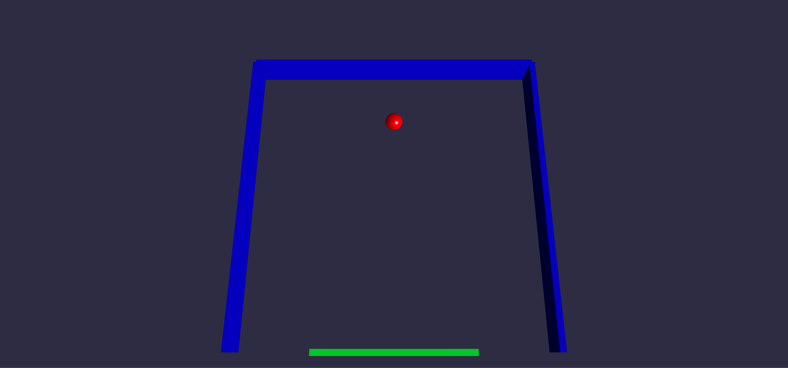
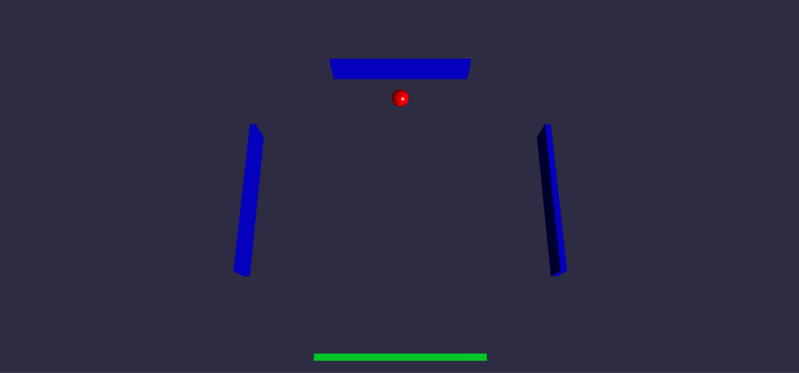

<br>

<p align="center">
  
  
  
  
</p>

<br>

# ngx-3d-pong

A 3D multiplayer pong game build by 
[Angular 11](https://github.com/angular/angular), 
[Babylon.js 4](https://github.com/BabylonJS/Babylon.js), 
[Socket.io 4](https://github.com/socketio/socket.io) 
and [Typescript 4](https://github.com/microsoft/TypeScript)

Single player:


Multi player:


<br/>

## Done and Todo

### Done
- Built a 3d pong game by Angular and Babylon.js.
- Support max. 4 players at the same time by socket.io.
- Each one gets one side of the screen where the paddle can move.
- If there are less than 4 players the unassigned sides should simply reflect the
  ball.
  
### Todo
- Game multi-session management (currently support only one game)
- Game Over and restart
- Game Configuration (speed, color and paddle length etc.)
- Better state management
- Unit tests
- User authentication/authorization
- User management (experience, level and vip etc.)
- Hosting

<br/>

## Install dependencies
client:
```shell
cd client
npm install or npm i
```

server:
```shell
cd server
npm install or npm i
```

<br/>

## Development and local testing
### Client:  The client server will be hosted on http://localhost:4200/ and opened automatically in browser. 
```shell
cd client
npm run start
or
ng serve -o
```
The client will automatically reload if you change any of its source files.


### Server: The server will be hosted on http://localhost:3000/.
```shell
cd server
npm run start
or
nodemon src/index.ts
```
The server will be automatically restarted if you change any of the source files.

** **To restart a new game please restart the server on http://localhost:3000/**

<br/>

## Demo
Currently it's only possiable to play the game on localhost.   
The plan for demo is:
1. Create the build for server
2. Find a hosting provider and deploy the whole application

<br/>

## Build
client:
Run `ng build` to build the project. The build artifacts will be stored in the `dist/` directory. Use the `--prod` flag for a production build.

server:
Todo

<br/>

## Unit tests
Todo

